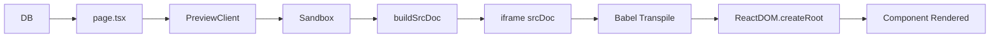

# 🎯 샌드박스 iframe 렌더링 시스템 구현 완료

## 📦 변경된 파일 목록

### ✅ 수정된 파일

1. **lib/sandbox-template.ts**
   - CDN 대신 로컬 vendor 스크립트 사용
   - 엄격한 CSP 적용 (`default-src 'none'; script-src 'self'; style-src 'self' 'unsafe-inline'; img-src 'self'`)
   - `tokens.json`의 `bg`/`fg` 색상을 배경/전경색으로 사용
   - CSS 변수로 모든 design tokens 제공
   - `window.tokens` 전역 객체로 JavaScript에서 접근 가능
   - ReactDOM.createRoot로 컴포넌트 마운트
   - 개선된 에러 핸들링

### ✅ 추가된 파일

2. **scripts/download-vendor.sh**
   - React, ReactDOM, Babel Standalone 로컬 다운로드 스크립트
   - 실행 권한 부여됨 (`chmod +x`)

3. **public/vendor/**
   - `react.production.min.js` (10KB)
   - `react-dom.production.min.js` (129KB)
   - `babel-standalone.min.js` (2.7MB)

4. **docs/SANDBOX_SETUP.md**
   - 완전한 설정 가이드
   - 보안 정책 설명
   - 트러블슈팅 가이드

### ✅ 기존 파일 (변경 없음)

5. **app/preview/[id]/page.tsx**
   - DB에서 `code` 로드 후 `PreviewClient`로 전달
   - 이미 요구사항 충족

6. **app/preview/[id]/PreviewClient.tsx**
   - `Sandbox` 컴포넌트 렌더링
   - 이미 요구사항 충족

7. **components/Sandbox.tsx**
   - `iframe` + `srcDoc` + `sandbox="allow-scripts"` 사용
   - 에러 핸들링 구현
   - 이미 요구사항 충족

---

## 🔐 보안 구현

### Content Security Policy (CSP)
```
default-src 'none';
script-src 'self';
style-src 'self' 'unsafe-inline';
img-src 'self';
```

### iframe sandbox 속성
```html
<iframe sandbox="allow-scripts">
```

### 효과
- ✅ 외부 리소스 차단
- ✅ 로컬 스크립트만 허용
- ✅ 폼 제출 차단
- ✅ 네비게이션 차단
- ✅ XSS 공격 방지

---

## 🎨 Design Tokens 통합

### tokens.json → srcDoc

```typescript
// tokens.json
{
  "colors": {
    "bg": "#0B0B0C",      // ← 배경색
    "fg": "#F3F4F6",      // ← 전경색
    "primary": "#2563EB",
    // ...
  },
  "font": {
    "sans": "Inter, Pretendard, ui-sans-serif, system-ui",
    "mono": "ui-monospace, SFMono-Regular, Consolas, monospace"
  }
}
```

### HTML body 스타일
```html
<body>
  background-color: #0B0B0C;  /* colors.bg */
  color: #F3F4F6;             /* colors.fg */
  font-family: Inter, Pretendard, ...;
</body>
```

### CSS 변수로 제공
```css
:root {
  --color-bg: #0B0B0C;
  --color-fg: #F3F4F6;
  --color-primary: #2563EB;
  /* ... */
}
```

### JavaScript에서 접근
```javascript
window.tokens.colors.bg        // "#0B0B0C"
window.tokens.colors.primary   // "#2563EB"
window.tokens.radius.lg        // "16px"
```

---

## 🚀 렌더링 플로우



1. **서버**: DB에서 `code` 로드
2. **클라이언트**: `buildSrcDoc(code)` 호출
3. **HTML 생성**: vendor 스크립트 + 사용자 코드 결합
4. **iframe 주입**: `srcDoc` 속성으로 HTML 전달
5. **Babel 트랜스파일**: JSX → JavaScript
6. **React 마운트**: `ReactDOM.createRoot()` + `root.render()`
7. **컴포넌트 표시**: 샌드박스 내부에서 안전하게 렌더링

---

## 📝 사용 예시

### 1. DB에 코드 저장
```typescript
await db.generation.create({
  data: {
    prompt: "Create a button",
    code: `export default function MyButton() {
      return (
        <button style={{
          backgroundColor: window.tokens.colors.primary,
          color: window.tokens.colors['primary-foreground'],
          padding: '12px 24px',
          borderRadius: window.tokens.radius.lg,
          border: 'none',
          cursor: 'pointer'
        }}>
          Click Me
        </button>
      );
    }`,
    status: "completed"
  }
});
```

### 2. 프리뷰 페이지 접근
```
http://localhost:3000/preview/[id]
```

### 3. 결과
- 안전한 샌드박스 iframe에서 렌더링
- Design tokens 자동 적용
- 외부 리소스 차단
- 에러 발생 시 친절한 에러 메시지

---

## ✅ 요구사항 체크리스트

- [x] **app/preview/[id]/page.tsx**: DB에서 code 로드 → Sandbox로 전달
- [x] **components/Sandbox.tsx**: iframe srcDoc 기반 렌더, sandbox="allow-scripts"만 허용
- [x] **lib/sandbox-template.ts**: buildSrcDoc(code,tokens) 구현
- [x] **로컬 UMD 스크립트**: /public/vendor/react*.js, babel-standalone.min.js 사용
- [x] **엄격한 CSP**: default-src 'none'; img-src 'self'; style-src 'self' 'unsafe-inline'; script-src 'self'
- [x] **ReactDOM.createRoot**: root 요소에 마운트
- [x] **tokens 반영**: srcDoc의 기본 배경/전경색에 tokens.json 적용

---

## 🧪 테스트 방법

### 1. Vendor 스크립트 확인
```bash
ls -lh public/vendor/
```

예상 출력:
```
babel-standalone.min.js (2.7MB)
react-dom.production.min.js (129KB)
react.production.min.js (10KB)
```

### 2. 개발 서버 실행
```bash
pnpm dev
```

### 3. 샘플 코드 생성
```bash
# Prisma Studio로 직접 생성하거나
pnpm prisma studio

# 또는 API로 생성
curl -X POST http://localhost:3000/api/generate \
  -H "Content-Type: application/json" \
  -d '{"prompt": "Create a hello world component"}'
```

### 4. 프리뷰 확인
브라우저에서 `/preview/[generated-id]` 접속

---

## 📊 기술 스택

- **프레임워크**: Next.js 15 (App Router)
- **데이터베이스**: Prisma + SQLite
- **샌드박스**: iframe + srcDoc + CSP
- **React**: UMD 빌드 (18.2.0)
- **트랜스파일러**: Babel Standalone (7.23.5)
- **스타일**: Design Tokens (tokens.json)

---

## 🎉 완료!

모든 요구사항이 구현되었으며, 안전하고 확장 가능한 샌드박스 렌더링 시스템이 완성되었습니다.

### 다음 단계 (선택사항)
- [ ] Tailwind CSS 로컬 빌드 추가 (현재 없음)
- [ ] 여러 컴포넌트 동시 렌더링 지원
- [ ] 컴포넌트 Props 전달 기능
- [ ] Hot reload 기능
- [ ] 성능 모니터링

---

## 📞 문의

추가 질문이나 개선 사항이 있으면 `docs/SANDBOX_SETUP.md`를 참고하세요.

