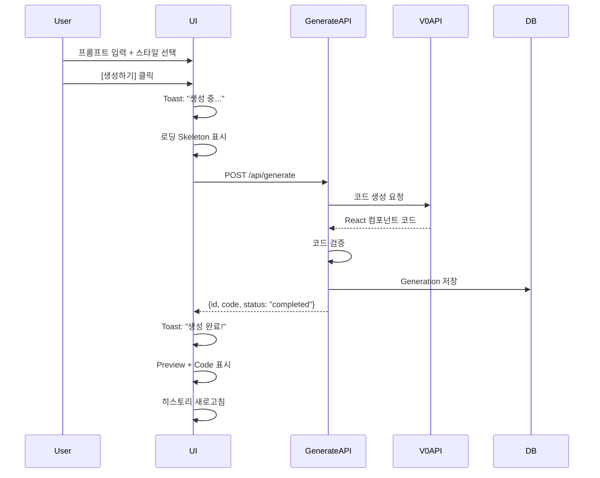
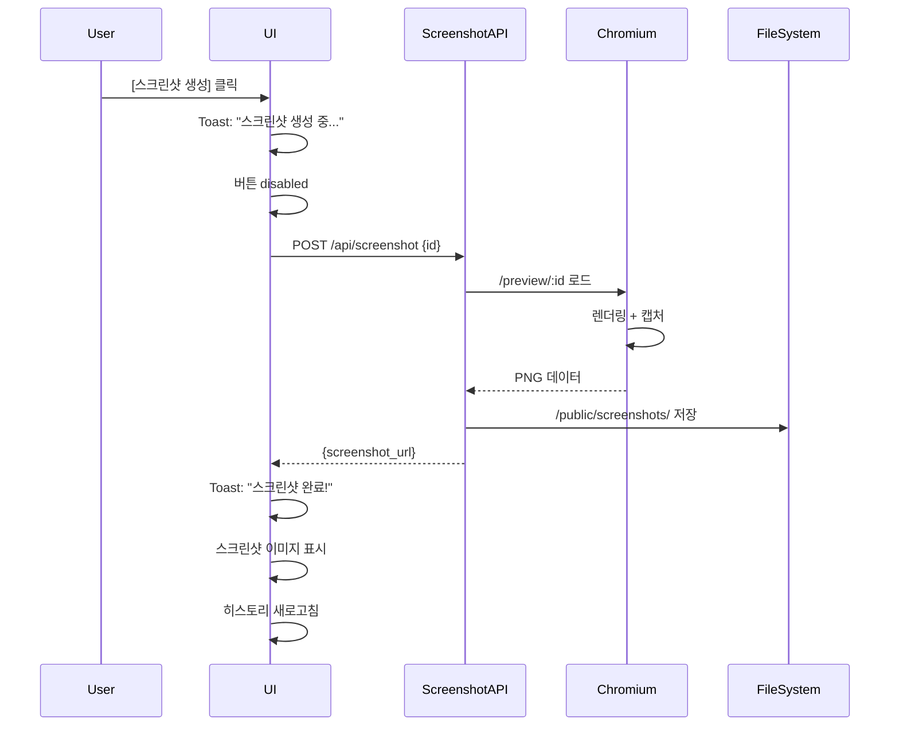
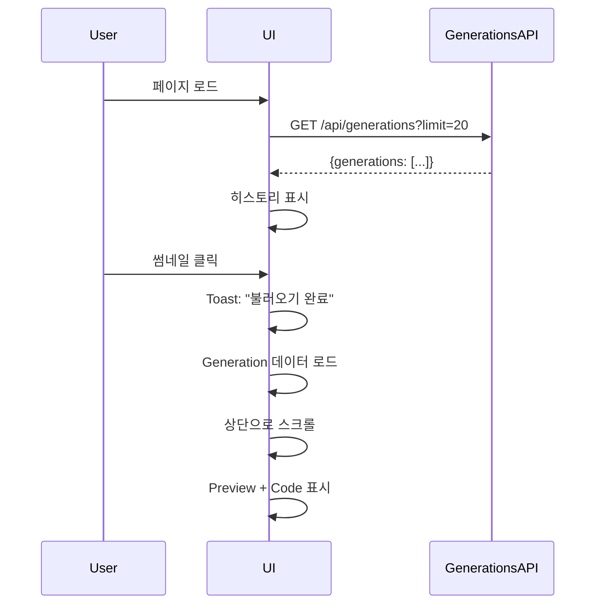

# 🎨 사용자 흐름 UI 구현 완료

## 📋 개요

전체 사용자 흐름을 가진 메인 페이지 구현:
**프리셋 선택 → 프롬프트 입력 → Generate → 미리보기/코드/스크린샷 → 히스토리**

## 📦 변경된 파일 목록

### ✅ 수정된 파일

1. **app/page.tsx** (전면 개선)
   - ✅ 상단: 스타일 프리셋 Select + 프롬프트 Textarea + [Generate] 버튼
   - ✅ 중앙 좌측: Code Viewer (Tabs - Preview/Code)
   - ✅ 중앙 우측: Preview (Sandbox iframe) + [Screenshot] 버튼
   - ✅ 하단: History (썸네일 그리드 + 프롬프트)
   - ✅ Toast 알림 시스템
   - ✅ 로딩 Skeleton
   - ✅ shadcn/ui 컴포넌트 사용

### ✅ 추가된 파일

2. **app/api/generations/route.ts** (신규)
   - GET /api/generations?limit=10
   - 최근 Generation 목록 반환
   - 히스토리 표시용

3. **app/api/generations/[id]/route.ts** (신규)
   - GET /api/generations/[id]
   - 특정 Generation 상세 조회
   - Assets 포함

4. **USER_FLOW_IMPLEMENTATION.md** (이 파일)
   - 구현 요약
   - 사용 가이드

### ✅ 기존 파일 (이미 구현됨)

5. **app/api/generate/route.ts**
   - POST /api/generate
   - V0 API를 통한 컴포넌트 생성
   - 코드 검증 및 재시도

6. **app/api/screenshot/route.ts**
   - POST /api/screenshot
   - Headless Chromium 스크린샷 캡처
   - 15초 타임아웃, 1회 재시도

7. **components/Sandbox.tsx**
   - iframe 기반 안전한 렌더링
   - sandbox="allow-scripts"

---

## 🎨 UI 구조

### 1. **상단: 입력 영역**

```
┌─────────────────────────────────────────────────┐
│  컴포넌트 생성                                   │
│  ─────────────────────────────────────────────  │
│                                                  │
│  스타일 프리셋: [Select ▼]                      │
│    ├─ Default (Dark)                            │
│    ├─ Light                                     │
│    └─ Modern                                    │
│                                                  │
│  프롬프트:                                       │
│  ┌──────────────────────────────────────────┐  │
│  │ 예: 현대적인 로그인 폼을...              │  │
│  │                                          │  │
│  └──────────────────────────────────────────┘  │
│                                                  │
│  [생성하기] (disabled when loading)             │
└─────────────────────────────────────────────────┘
```

**기능**:
- Select: 스타일 프리셋 선택
- Textarea: 프롬프트 입력 (min-height: 120px, 자동 리사이즈)
- Button: Generate 실행 (disabled 상태 처리)

---

### 2. **중앙: 결과 표시 (2-Column Grid)**

#### 좌측: Preview & Code Tabs

```
┌─────────────────────────────────────────┐
│ [미리보기] [코드]                        │
├─────────────────────────────────────────┤
│                                          │
│  <미리보기 탭>                            │
│  ┌───────────────────────────────────┐  │
│  │                                   │  │
│  │     Sandbox iframe                │  │
│  │     (500px height)                │  │
│  │                                   │  │
│  └───────────────────────────────────┘  │
│                                          │
│  [📸 스크린샷 생성]                       │
│                                          │
│  ──────────────────────────────────────  │
│                                          │
│  <코드 탭>                               │
│  ┌───────────────────────────────────┐  │
│  │ export default function...        │  │
│  │                                   │  │
│  │ (code with syntax highlighting)   │  │
│  │                                   │  │
│  └───────────────────────────────────┘  │
│                                          │
│  [📥 코드 다운로드 (.tsx)]                │
└─────────────────────────────────────────┘
```

**기능**:
- Tabs: Preview ↔ Code 전환
- Preview: Sandbox 컴포넌트로 안전한 렌더링
- Screenshot 버튼: 현재 preview 캡처
- Code: syntax highlighting된 코드 표시
- Download 버튼: .tsx 파일 다운로드

#### 우측: 정보 & 스크린샷

```
┌─────────────────────────────────┐
│  생성 정보                       │
│  ──────────────────────────────  │
│  ID: clxxx123456...             │
│  프롬프트: 현대적인 로그인...    │
│  스타일: default                │
│  상태: [completed]              │
└─────────────────────────────────┘

┌─────────────────────────────────┐
│  스크린샷                        │
│  ──────────────────────────────  │
│  ┌───────────────────────────┐  │
│  │                           │  │
│  │   [스크린샷 이미지]        │  │
│  │                           │  │
│  └───────────────────────────┘  │
│                                  │
│  [🖼️ 이미지 다운로드]            │
└─────────────────────────────────┘
```

---

### 3. **하단: 히스토리 (Thumbnail Grid)**

```
┌──────────────────────────────────────────────────────────────┐
│  히스토리                                                     │
│  최근 생성된 컴포넌트 목록                                     │
│  ────────────────────────────────────────────────────────────  │
│                                                               │
│  ┌─────────┐  ┌─────────┐  ┌─────────┐  ┌─────────┐        │
│  │[썸네일] │  │[썸네일] │  │[썸네일] │  │[썸네일] │        │
│  │[상태]   │  │[상태]   │  │[상태]   │  │[상태]   │        │
│  │         │  │         │  │         │  │         │        │
│  │프롬프트 │  │프롬프트 │  │프롬프트 │  │프롬프트 │        │
│  │12/25 3PM│  │12/25 2PM│  │12/24 5PM│  │12/23 1PM│        │
│  └─────────┘  └─────────┘  └─────────┘  └─────────┘        │
│                                                               │
│  (반응형 그리드: 1~4 columns)                                 │
└──────────────────────────────────────────────────────────────┘
```

**기능**:
- 썸네일: screenshot_url 또는 "미리보기 없음" 표시
- 상태 배지: completed (파란색), failed (빨간색), pending (회색)
- 프롬프트: 최대 2줄 (line-clamp-2)
- 날짜: 한국어 포맷 (12월 25일 오후 3:00)
- 클릭: 해당 Generation 로드
- 호버 효과: scale-105, opacity 변화

---

## 🎯 사용자 흐름

### 1. **컴포넌트 생성**



**단계**:
1. 사용자 입력 검증
2. 로딩 상태 시작 (토스트 + 스켈레톤)
3. Generate API 호출
4. 성공 시: 결과 표시 + 토스트
5. 실패 시: 에러 토스트
6. 히스토리 자동 새로고침

---

### 2. **스크린샷 생성**



**단계**:
1. 버튼 클릭
2. 로딩 상태 시작 (토스트 + 버튼 disabled)
3. Screenshot API 호출
4. 성공 시: 이미지 표시 + 토스트
5. 실패 시: 에러 토스트
6. 히스토리 자동 새로고침

---

### 3. **히스토리에서 불러오기**



**단계**:
1. 페이지 로드 시 자동으로 히스토리 로드
2. 썸네일 클릭
3. 해당 Generation 데이터 로드
4. UI 업데이트 (프롬프트, 스타일, 결과)
5. 부드러운 스크롤

---

## 🎨 UI 컴포넌트

### shadcn/ui 컴포넌트 사용

```typescript
import { useToast } from "@/hooks/use-toast";
import { Toaster } from "@/components/ui/toaster";
import { Skeleton } from "@/components/ui/skeleton";
import { Tabs, TabsContent, TabsList, TabsTrigger } from "@/components/ui/tabs";
import { Button } from "@/components/ui/button";
import { Card, CardContent, CardDescription, CardHeader, CardTitle } from "@/components/ui/card";
import { Textarea } from "@/components/ui/textarea";
import { Select, SelectContent, SelectItem, SelectTrigger, SelectValue } from "@/components/ui/select";
```

### 토스트 알림

```typescript
// 성공
toast({
  title: "생성 완료!",
  description: "컴포넌트가 성공적으로 생성되었습니다.",
});

// 에러
toast({
  title: "생성 실패",
  description: message,
  variant: "destructive",
});
```

### 로딩 Skeleton

```tsx
<Card>
  <CardHeader>
    <Skeleton className="h-6 w-32" />
    <Skeleton className="h-4 w-full mt-2" />
  </CardHeader>
  <CardContent>
    <Skeleton className="h-[400px] w-full" />
  </CardContent>
</Card>
```

---

## 📊 API 엔드포인트

### 1. POST /api/generate

**요청**:
```json
{
  "prompt": "현대적인 로그인 폼 만들어주세요",
  "style": "default"
}
```

**응답** (성공):
```json
{
  "id": "clxxx123456",
  "code": "export default function...",
  "status": "completed",
  "attempts": 1
}
```

---

### 2. POST /api/screenshot

**요청**:
```json
{
  "id": "clxxx123456",
  "viewport": { "width": 1280, "height": 800 },
  "fullPage": false
}
```

**응답** (성공):
```json
{
  "screenshot_url": "/screenshots/clxxx123456_1697123456789.png",
  "success": true,
  "filepath": "/path/to/file.png",
  "filesize": 153728
}
```

---

### 3. GET /api/generations?limit=10

**응답**:
```json
{
  "generations": [
    {
      "id": "clxxx123456",
      "prompt": "로그인 폼",
      "style": "default",
      "code": "...",
      "status": "completed",
      "screenshot_url": "/screenshots/...",
      "created_at": "2025-10-17T12:34:56Z",
      "_count": { "assets": 1 }
    }
  ],
  "total": 10
}
```

---

### 4. GET /api/generations/[id]

**응답**:
```json
{
  "id": "clxxx123456",
  "prompt": "로그인 폼",
  "style": "default",
  "code": "...",
  "status": "completed",
  "screenshot_url": "/screenshots/...",
  "created_at": "2025-10-17T12:34:56Z",
  "updated_at": "2025-10-17T12:35:00Z",
  "assets": [
    {
      "id": "asset123",
      "kind": "screenshot",
      "path": "/screenshots/...",
      "created_at": "2025-10-17T12:35:00Z"
    }
  ]
}
```

---

## 🎬 사용 예시

### 1. 기본 사용

1. **페이지 접속**: `http://localhost:3000`
2. **스타일 선택**: "Default (Dark)"
3. **프롬프트 입력**: "현대적인 로그인 폼을 만들어주세요"
4. **생성하기 클릭**
5. **결과 확인**: Preview 탭에서 실시간 확인
6. **코드 보기**: Code 탭으로 전환
7. **스크린샷**: 📸 버튼 클릭
8. **다운로드**: 코드 또는 이미지 다운로드

### 2. 히스토리 활용

1. **히스토리 섹션으로 스크롤**
2. **썸네일 클릭**
3. **자동으로 상단 이동 + 데이터 로드**
4. **수정 후 재생성 가능**

---

## 🚀 실행 방법

```bash
# 1. 개발 서버 실행
pnpm dev

# 2. 브라우저 접속
# http://localhost:3000

# 3. V0 API 키 설정 (.env.local)
V0_API_KEY=your_actual_v0_api_key_here
NEXT_PUBLIC_BASE_URL=http://localhost:3000
DATABASE_URL="file:./prisma/dev.db"

# 4. DB 마이그레이션 (필요시)
pnpm prisma migrate dev

# 5. Vendor 스크립트 다운로드 (필요시)
bash scripts/download-vendor.sh

# 6. Playwright Chromium 설치 (필요시)
pnpm playwright install chromium
```

---

## ✅ 요구사항 체크리스트

### UI 구조
- [x] **상단**: 스타일 프리셋 Select + 프롬프트 Textarea + [Generate] 버튼
- [x] **중앙 좌측**: Code Viewer (Tabs - Preview/Code)
- [x] **중앙 우측**: Preview (Sandbox iframe) + [Screenshot] 버튼
- [x] **하단**: History (썸네일 그리드 + 프롬프트)

### 기능
- [x] **토스트 알림**: 성공/에러/진행 상태
- [x] **로딩 Skeleton**: 생성 중 표시
- [x] **Sandbox 렌더링**: 안전한 iframe 렌더링
- [x] **스크린샷**: Headless Chromium 캡처
- [x] **히스토리**: 최근 20개 표시
- [x] **다운로드**: 코드 (.tsx) 및 이미지 (.png)

### API
- [x] **POST /api/generate**: V0 API 기반 생성
- [x] **POST /api/screenshot**: Playwright 스크린샷
- [x] **GET /api/generations**: 목록 조회
- [x] **GET /api/generations/[id]**: 상세 조회

---

## 📁 파일 구조

```
/Users/skim15/dev/QDS-Design-auto/
├── app/
│   ├── page.tsx                              # ✅ 메인 페이지 (전면 개선)
│   ├── preview/[id]/
│   │   ├── page.tsx                          # Preview 렌더링
│   │   └── PreviewClient.tsx                 # Sandbox 컴포넌트 사용
│   └── api/
│       ├── generate/
│       │   └── route.ts                      # ✅ 컴포넌트 생성 API
│       ├── screenshot/
│       │   └── route.ts                      # ✅ 스크린샷 API
│       └── generations/
│           ├── route.ts                      # ✅ 목록 API (신규)
│           └── [id]/
│               └── route.ts                  # ✅ 상세 API (신규)
├── components/
│   ├── Sandbox.tsx                           # ✅ 안전한 iframe 렌더링
│   └── ui/                                   # shadcn/ui 컴포넌트
│       ├── button.tsx
│       ├── card.tsx
│       ├── skeleton.tsx
│       ├── tabs.tsx
│       ├── textarea.tsx
│       ├── select.tsx
│       ├── toast.tsx
│       └── toaster.tsx
├── lib/
│   ├── db.ts                                 # Prisma helpers
│   ├── sandbox-template.ts                   # ✅ Sandbox HTML 빌더
│   └── ui-theme.ts
├── hooks/
│   └── use-toast.ts                          # Toast hook
├── public/
│   ├── vendor/                               # ✅ 로컬 UMD 스크립트
│   │   ├── react.production.min.js
│   │   ├── react-dom.production.min.js
│   │   └── babel-standalone.min.js
│   └── screenshots/                          # ✅ 생성된 스크린샷
│       └── *.png
├── docs/
│   ├── SANDBOX_SETUP.md
│   ├── SCREENSHOT_API.md
│   └── TOKEN_SYSTEM.md
├── IMPLEMENTATION_SUMMARY.md
├── SCREENSHOT_IMPLEMENTATION.md
└── USER_FLOW_IMPLEMENTATION.md               # ✅ 이 파일
```

---

## 🎉 완료!

전체 사용자 흐름이 완성되었습니다!

### 주요 특징
- ✅ **직관적인 UI**: 3-Section 레이아웃 (입력 → 결과 → 히스토리)
- ✅ **실시간 피드백**: 토스트 알림 + 로딩 상태
- ✅ **안전한 렌더링**: Sandbox iframe + CSP
- ✅ **반응형 디자인**: 모바일 ~ 데스크탑 지원
- ✅ **디자인 시스템**: shadcn/ui + tokens.json
- ✅ **TypeScript**: 타입 안전성

### 다음 단계 (선택사항)
- [ ] 다크/라이트 테마 전환
- [ ] 더 많은 스타일 프리셋 추가
- [ ] 컴포넌트 공유 기능
- [ ] 실시간 협업 기능
- [ ] AI 모델 선택 옵션

**즐거운 코딩 되세요!** 🚀


