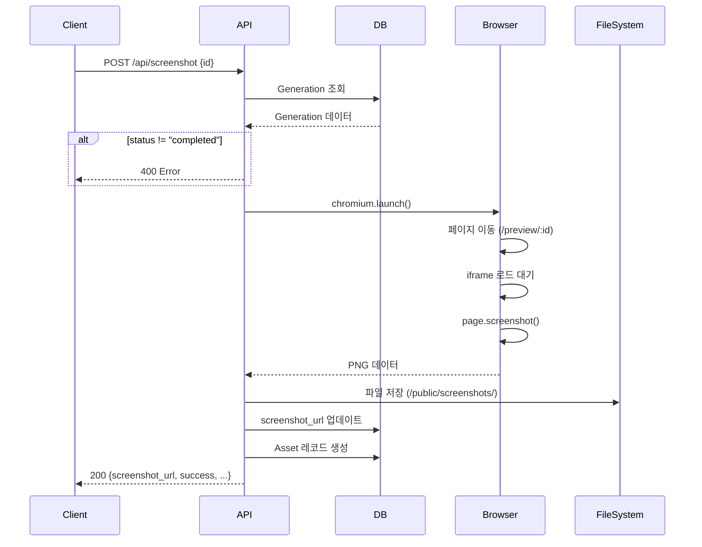

# 📸 스크린샷 캡처 API

## 📋 개요

서버에서 `/preview/:id` 페이지를 headless Chromium으로 캡처하여 PNG 파일을 생성하는 API입니다.

## 🔌 API 엔드포인트

### POST `/api/screenshot`

**요청 본문 (JSON)**

```typescript
{
  id: string;              // Generation ID (필수)
  viewport?: {             // 뷰포트 크기 (선택)
    width: number;         // 320-3840 (기본값: 1280)
    height: number;        // 240-2160 (기본값: 800)
  };
  fullPage?: boolean;      // 전체 페이지 캡처 여부 (기본값: false)
}
```

**성공 응답 (200)**

```typescript
{
  screenshot_url: string;  // "/screenshots/[id]_[timestamp].png"
  success: true;
  filepath: string;        // 절대 경로
  filesize: number;        // 바이트 단위
}
```

**에러 응답 (4xx/5xx)**

```typescript
{
  error: string;           // 에러 메시지
  details?: string;        // 상세 정보
  retries?: number;        // 재시도 횟수
}
```

## 📊 HTTP 상태 코드

| 코드 | 설명 |
|------|------|
| 200 | 스크린샷 생성 성공 |
| 400 | 잘못된 요청 (ID 누락, viewport 범위 초과 등) |
| 404 | Generation을 찾을 수 없음 |
| 504 | 타임아웃 (15초 초과) |
| 500 | 서버 내부 오류 |

## 🏗️ 동작 플로우



## ⚙️ 구성

### 타임아웃
- **페이지 로드**: 15초
- **iframe 대기**: 15초
- **총 시간**: 최대 ~17초 (페이지 로드 + 애니메이션 대기 1초 + 캡처)

### 재시도
- **최대 재시도 횟수**: 1회
- **재시도 대기 시간**: 2초

### Chromium 설정
```typescript
{
  headless: true,
  args: [
    "--no-sandbox",
    "--disable-setuid-sandbox",
    "--disable-dev-shm-usage",
  ]
}
```

### 스크린샷 설정
```typescript
{
  path: "/public/screenshots/[id]_[timestamp].png",
  fullPage: false,        // 기본값
  type: "png",
  deviceScaleFactor: 2,   // Retina 해상도
}
```

## 📝 사용 예시

### 1. 기본 스크린샷

```bash
curl -X POST http://localhost:3000/api/screenshot \
  -H "Content-Type: application/json" \
  -d '{"id": "clxxx123456"}'
```

**응답**
```json
{
  "screenshot_url": "/screenshots/clxxx123456_1697123456789.png",
  "success": true,
  "filepath": "/path/to/public/screenshots/clxxx123456_1697123456789.png",
  "filesize": 153728
}
```

### 2. 커스텀 Viewport

```bash
curl -X POST http://localhost:3000/api/screenshot \
  -H "Content-Type: application/json" \
  -d '{
    "id": "clxxx123456",
    "viewport": {"width": 1920, "height": 1080}
  }'
```

### 3. Full Page 스크린샷

```bash
curl -X POST http://localhost:3000/api/screenshot \
  -H "Content-Type: application/json" \
  -d '{
    "id": "clxxx123456",
    "fullPage": true
  }'
```

### 4. TypeScript/JavaScript

```typescript
async function captureScreenshot(id: string) {
  const response = await fetch('/api/screenshot', {
    method: 'POST',
    headers: { 'Content-Type': 'application/json' },
    body: JSON.stringify({
      id,
      viewport: { width: 1280, height: 800 },
      fullPage: false,
    }),
  });

  if (!response.ok) {
    const error = await response.json();
    throw new Error(error.details || error.error);
  }

  const result = await response.json();
  console.log('Screenshot URL:', result.screenshot_url);
  return result;
}
```

## 🐛 에러 처리

### 1. Generation을 찾을 수 없음 (404)

```json
{
  "error": "Generation not found",
  "details": "Generation with id 'invalid-id' not found",
  "retries": 1
}
```

### 2. Generation 상태가 올바르지 않음 (400)

```json
{
  "error": "Generation status is 'pending', expected 'completed'",
  "details": "Generation status is 'pending', expected 'completed'",
  "retries": 1
}
```

### 3. Viewport 범위 초과 (400)

```json
{
  "error": "Invalid viewport",
  "details": "Viewport width must be 320-3840px, height must be 240-2160px"
}
```

### 4. 타임아웃 (504)

```json
{
  "error": "Screenshot capture timed out (15s limit)",
  "details": "Timeout 15000ms exceeded",
  "retries": 1
}
```

### 5. 서버 내부 오류 (500)

```json
{
  "error": "Failed to capture screenshot",
  "details": "Browser launch failed: ...",
  "retries": 1
}
```

## 🧪 테스트

### 자동 테스트 스크립트

```bash
# Generation ID와 함께 실행
bash scripts/test-screenshot.sh clxxx123456
```

테스트 항목:
1. ✅ 기본 스크린샷 (1280x800)
2. ✅ 커스텀 viewport (1920x1080)
3. ✅ Full page 스크린샷
4. ✅ 잘못된 ID (404 에러)
5. ✅ 잘못된 viewport (400 에러)

### 수동 테스트

1. **개발 서버 실행**
   ```bash
   pnpm dev
   ```

2. **Generation 생성**
   ```bash
   # Prisma Studio에서 또는 generate API로
   ```

3. **스크린샷 API 호출**
   ```bash
   curl -X POST http://localhost:3000/api/screenshot \
     -H "Content-Type: application/json" \
     -d '{"id": "[your-generation-id]"}'
   ```

4. **결과 확인**
   ```bash
   ls -lh public/screenshots/
   # 브라우저에서: http://localhost:3000/screenshots/[filename].png
   ```

## 📁 파일 저장 구조

```
/Users/skim15/dev/QDS-Design-auto/
├── public/
│   └── screenshots/
│       ├── clxxx123456_1697123456789.png  # Generation 1
│       ├── clyyy789012_1697123567890.png  # Generation 2
│       └── ...
```

**파일명 형식**: `{generation_id}_{timestamp}.png`

**접근 URL**: `http://localhost:3000/screenshots/{filename}.png`

## 🔄 DB 업데이트

스크린샷 생성 후 자동으로 다음 작업 수행:

### 1. Generation 업데이트

```sql
UPDATE Generation
SET screenshot_url = '/screenshots/[id]_[timestamp].png'
WHERE id = '[generation_id]';
```

### 2. Asset 레코드 생성

```sql
INSERT INTO Asset (id, generationId, kind, path, created_at)
VALUES ('[asset_id]', '[generation_id]', 'screenshot', '/screenshots/...', NOW());
```

## ⚡ 성능 최적화

### 현재 구현
- **Retina 해상도**: deviceScaleFactor: 2 (고해상도)
- **네트워크 대기**: waitUntil: "networkidle" (모든 리소스 로드 대기)
- **애니메이션 대기**: 1초

### 개선 가능한 부분
1. **Browser 인스턴스 재사용**
   - 현재: 매 요청마다 새로운 브라우저 실행
   - 개선: 글로벌 브라우저 풀 사용 (예: 5개 인스턴스)

2. **병렬 처리**
   - 현재: 순차 처리
   - 개선: Queue 시스템 (예: Bull, BullMQ)

3. **캐싱**
   - 현재: 매번 새로 생성
   - 개선: 동일 ID 재요청 시 기존 파일 반환

## 🚨 트러블슈팅

### 1. "Browser launch failed"
- **원인**: Chromium 바이너리가 없거나 권한 문제
- **해결**: 
  ```bash
  pnpm playwright install chromium
  ```

### 2. "Timeout exceeded"
- **원인**: 페이지 로딩이 15초 초과
- **해결**: 
  - 컴포넌트 코드 최적화
  - vendor 스크립트 로컬 확인
  - 네트워크 상태 확인

### 3. "Screenshot file is empty"
- **원인**: 페이지가 제대로 렌더링되지 않음
- **해결**:
  - `/preview/:id` 페이지 직접 확인
  - 브라우저 콘솔 에러 확인
  - iframe 로딩 상태 확인

### 4. "Permission denied"
- **원인**: `/public/screenshots/` 쓰기 권한 없음
- **해결**:
  ```bash
  mkdir -p public/screenshots
  chmod 755 public/screenshots
  ```

### 5. 재시도 후에도 실패
- **원인**: 시스템 리소스 부족, 브라우저 크래시 등
- **해결**:
  - 로그 확인: `console.log` 출력
  - 메모리 확인: `free -h` (Linux) / `top` (Mac)
  - Chromium 프로세스 확인: `ps aux | grep chromium`

## 🔐 보안 고려사항

### 1. Path Traversal 방지
- Generation ID 검증 (DB 조회로 간접 검증)
- 파일명에 timestamp 추가 (덮어쓰기 방지)

### 2. DoS 방지
- 타임아웃 설정 (15초)
- 재시도 제한 (1회)
- Viewport 범위 제한 (320-3840 x 240-2160)

### 3. 리소스 정리
- Browser 인스턴스 확실하게 종료
- 실패 시에도 `browser.close()` 호출

## 📚 참고 자료

- [Playwright API](https://playwright.dev/docs/api/class-playwright)
- [Chromium Headless](https://developer.chrome.com/blog/headless-chrome/)
- [Next.js API Routes](https://nextjs.org/docs/app/building-your-application/routing/route-handlers)

## 🔄 업데이트 로그

### v1.0 (2025-10-17)
- ✅ 기본 스크린샷 캡처 기능
- ✅ 타임아웃 15초
- ✅ 1회 재시도
- ✅ viewport, fullPage 옵션
- ✅ 에러 타입별 상세 메시지
- ✅ DB 자동 업데이트 (screenshot_url, Asset)
- ✅ 테스트 스크립트 제공

